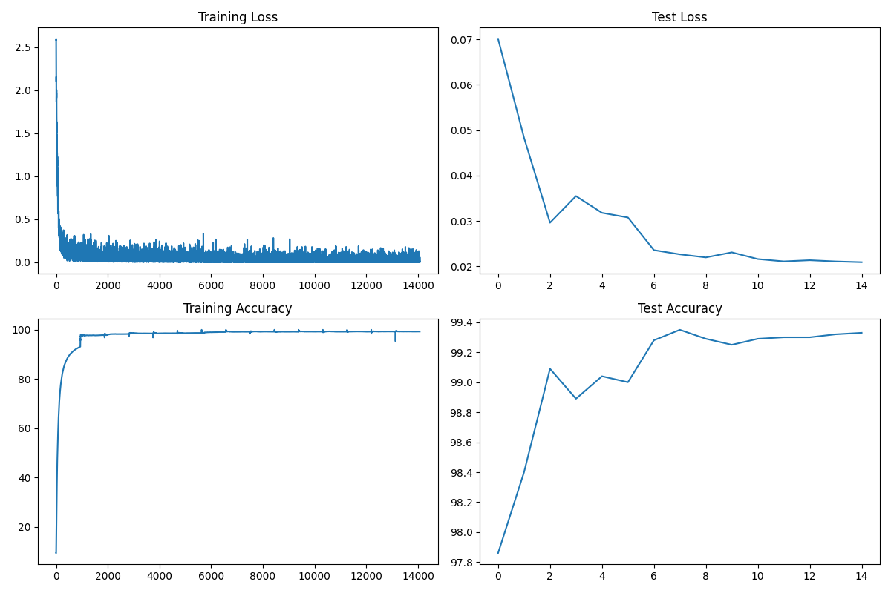
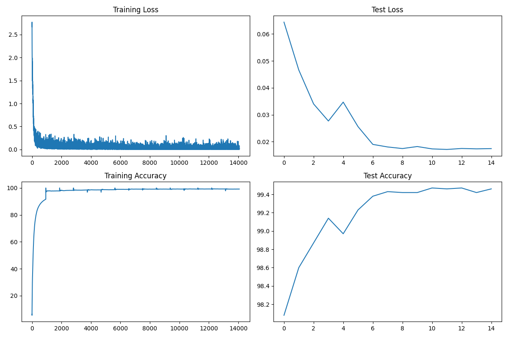
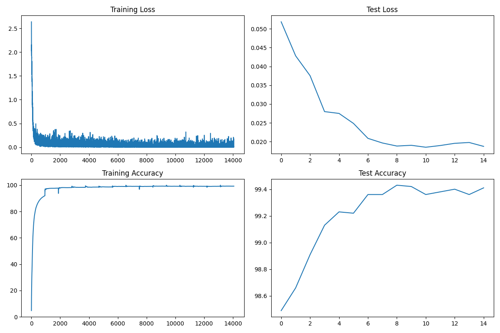

# 🧠 MNIST Classification Project

A comprehensive deep learning project implementing three different CNN architectures for MNIST digit classification, featuring modular design patterns, advanced learning rate scheduling, and complete reproducibility.

## 📊 Project Overview

This project demonstrates the evolution of CNN architectures for MNIST classification, implementing three distinct models with varying complexity and performance characteristics. The codebase showcases modern software engineering practices including the Strategy design pattern, centralized imports, and comprehensive logging.

## 🏗️ Architecture

### Model Variants

| Model | Parameters | Architecture | Best Accuracy | Dropout | Key Features |
|-------|------------|--------------|---------------|---------|--------------|
| **Model V1** | 7,720 | Complex CNN with AvgPool | ~99.4% | 0.01 | Conv-only output, AvgPool |
| **Model V2** | 7,730 | CNN + Linear Layer | ~99.4% | 0.025 | Linear layer (10→10) |
| **Model V3** | 8,650 | Lightweight CNN | ~99.4% | 0.025 | AdaptiveAvgPool, 8 conv blocks |

### Detailed Model Analysis

#### Model V1 (7,720 parameters) - Conv-Only Architecture
```python
# Architecture Flow: 28×28×1 → 26×26×8 → 24×24×16 → 24×24×10 → 12×12×10 → 10×10×16 → 8×8×16 → 6×6×10 → 6×6×10 → 3×3×10 → 1×1×10
```
- **Input Block**: Conv2d(1→8) + ReLU + BatchNorm + Dropout(0.01)
- **Conv Block 1**: Conv2d(8→16) + ReLU + BatchNorm + Dropout(0.01)
- **Transition**: Conv2d(16→10, 1×1) + MaxPool2d(2×2)
- **Conv Block 2**: 4 consecutive Conv2d layers with increasing complexity
- **Output**: AvgPool2d(3×3) + Conv2d(10→10, 1×1) + LogSoftmax

#### Model V2 (7,730 parameters) - CNN + Linear Architecture
```python
# Architecture Flow: 28×28×1 → 26×26×8 → 24×24×16 → 24×24×10 → 12×12×10 → 10×10×16 → 8×8×16 → 6×6×10 → 6×6×10 → 3×3×10 → 1×1×10 → Linear(10→10)
```
- **Similar to V1** but with final Linear layer
- **Key Difference**: Linear(10, 10) instead of Conv2d(10→10, 1×1)
- **Dropout**: 0.025 (higher than V1)

#### Model V3 (8,650 parameters) - Advanced CNN Architecture
```python
# Architecture Flow: 28×28×1 → 26×26×8 → 24×24×16 → 24×24×10 → 12×12×10 → 10×10×10 → 10×10×16 → 8×8×16 → 6×6×10 → 6×6×10 → 3×3×10 → 1×1×10 → Linear(10→10)
```
- **Most Complex**: 8 convolution blocks
- **Key Features**: 
  - AdaptiveAvgPool2d instead of fixed AvgPool2d
  - More sophisticated channel progression
  - Higher dropout (0.025)
  - Explicit flattening with view()

## 🚀 Key Features

### 🎯 Design Patterns
- **Strategy Pattern**: Dynamic model selection at runtime
- **Modular Architecture**: Separated concerns for data, models, and visualization
- **Centralized Imports**: Single source of truth for dependencies

### 📈 Learning Rate Scheduling
- **StepLR**: Traditional step-based learning rate decay
- **OneCycleLR**: Advanced cyclical learning rate policy
  - Peak LR: 0.75 (configurable)
  - Cosine annealing strategy
  - 30% warmup period
  - Cycle momentum disabled

### 📊 Comprehensive Logging
- **Model Summaries**: Detailed layer-by-layer analysis
- **Training Metrics**: Loss and accuracy tracking
- **Visualization**: Automated plot generation
- **Reproducibility**: Complete state saving

## 📁 Project Structure

```
📦 MNIST Classification Project
├── 📁 models/                    # Model implementations
│   ├── model_v1.py              # Complex CNN architecture (7,720 params)
│   ├── model_v2.py              # CNN + Linear architecture (7,730 params)
│   └── model_v3.py              # Lightweight CNN (8,650 params)
├── 📁 notebooks/                 # Original Jupyter notebooks
│   ├── Mnsit_v4.ipynb
│   ├── Mnsit_v5.ipynb
│   └── Mnsit_v6.ipynb
├── 📁 outputs/                   # Training outputs
│   ├── mnist_model_*_params.pth # Model weights
│   └── mnist_model_*_metrics.json # Training metrics
├── 📁 plots/                     # Generated visualizations
│   ├── mnist_model_1.png        # Model V1 training plots
│   ├── mnist_model_2.png        # Model V2 training plots
│   └── mnist_model_3.png        # Model V3 training plots
├── 📁 summaries/                 # Model architecture summaries
│   ├── mnist_model_1_summary.txt
│   ├── mnist_model_2_summary.txt
│   └── mnist_model_3_summary.txt
├── 📁 data/                      # MNIST dataset
├── 🔧 Core Modules
│   ├── main.py                  # Main training script
│   ├── data_utils.py            # Data loading utilities
│   ├── lr_schedulers.py         # Learning rate scheduling
│   ├── model_strategy.py        # Strategy pattern implementation
│   ├── visualization.py         # Plotting and saving utilities
│   └── imports.py               # Centralized imports
└── 📄 README.md
```

## 🛠️ Installation & Usage

### Prerequisites
```bash
pip install torch torchvision torchsummary tqdm matplotlib
```

### Quick Start

#### Train Model V1 with OneCycleLR (15 epochs)
```bash
python main.py --model 1 --scheduler onecycle --epochs 15
```

#### Train Model V2 with StepLR (10 epochs)
```bash
python main.py --model 2 --scheduler step --epochs 10
```

#### Train Model V3 with custom learning rate
```bash
python main.py --model 3 --scheduler onecycle --epochs 20 --max_lr 0.5
```

### Command Line Arguments

| Argument | Options | Default | Description |
|----------|---------|---------|-------------|
| `--model` | 1, 2, 3 | 1 | Model version to train |
| `--epochs` | integer | 10 | Number of training epochs |
| `--scheduler` | step, onecycle | step | Learning rate scheduler |
| `--max_lr` | float | 0.75 | Maximum LR for OneCycleLR |

## 📈 Performance Results

### Training Progress (Model V3 - 15 epochs)
```
EPOCH: 0  - Test Accuracy: 98.49%
EPOCH: 1  - Test Accuracy: 98.66%
EPOCH: 2  - Test Accuracy: 98.91%
EPOCH: 3  - Test Accuracy: 99.13%
EPOCH: 4  - Test Accuracy: 99.23%
EPOCH: 5  - Test Accuracy: 99.22%
EPOCH: 6  - Test Accuracy: 99.36%
EPOCH: 7  - Test Accuracy: 99.36%
EPOCH: 8  - Test Accuracy: 99.43% ⭐ BEST
EPOCH: 9  - Test Accuracy: 99.42%
EPOCH: 10 - Test Accuracy: 99.36%
EPOCH: 11 - Test Accuracy: 99.38%
EPOCH: 12 - Test Accuracy: 99.40%
EPOCH: 13 - Test Accuracy: 99.36%
EPOCH: 14 - Test Accuracy: 99.41%
```

### Model Performance Comparison

| Model | Parameters | Best Accuracy | Convergence | Architecture Type |
|-------|------------|---------------|-------------|-------------------|
| **V1** | 7,720 | 99.4% | Fast | Conv-only |
| **V2** | 7,730 | 99.4% | Fast | CNN + Linear |
| **V3** | 8,650 | 99.43% | Fast | Advanced CNN |

### Training Visualizations

#### Model V1 Training Results

*Model V1: Conv-only architecture with 7,720 parameters*

#### Model V2 Training Results

*Model V2: CNN + Linear architecture with 7,730 parameters*

#### Model V3 Training Results

*Model V3: Advanced CNN architecture with 8,650 parameters - Best Performance*

## 🔄 Reproducibility Features

### Automatic Saving
- **Model Weights**: `.pth` files for complete model state
- **Training Metrics**: JSON files with loss/accuracy history
- **Architecture Summaries**: Detailed layer information
- **Visualization Plots**: Training progress charts

### Loading Saved Models
```python
from visualization import load_model_params, load_metrics_json
from models import model_v1

# Load model weights
model = model_v1.Net()
model = load_model_params(model, "mnist_model_1")

# Load training metrics
metrics = load_metrics_json("mnist_model_1")
```

## 🎨 Visualization Features

The project automatically generates comprehensive visualizations:

- **Training Loss**: Per-batch loss progression
- **Test Loss**: Per-epoch validation loss
- **Training Accuracy**: Real-time accuracy tracking
- **Test Accuracy**: Validation accuracy over epochs

All plots are saved as high-quality PNG files in the `plots/` directory with consistent naming: `mnist_model_{version}.png`

## 🔧 Technical Implementation

### Strategy Pattern Implementation
```python
# Dynamic model selection
class ModelStrategy:
    def get_model(self, device):
        raise NotImplementedError

class Model1Strategy(ModelStrategy):
    def get_model(self, device):
        return model_v1.Net().to(device)

# Usage
strategy = get_strategy(args.model)  # '1', '2', or '3'
context = ModelContext(strategy)
model = context.get_model(device)
```

### Learning Rate Scheduling
```python
# OneCycleLR with custom parameters
scheduler = OneCycleLR(
    optimizer,
    max_lr=0.75,
    epochs=15,
    steps_per_epoch=len(train_loader),
    pct_start=0.3,
    anneal_strategy='cos',
    div_factor=7.5,
    final_div_factor=7.5,
    cycle_momentum=False
)
```

### Data Augmentation Pipeline
```python
# Training transforms
train_transforms = transforms.Compose([
    transforms.RandomRotation((-7.0, 7.0), fill=(1,)),  # Rotation augmentation
    transforms.ToTensor(),                              # Convert to tensor
    transforms.Normalize((0.1307,), (0.3081,))         # MNIST normalization
])

# Test transforms (no augmentation)
test_transforms = transforms.Compose([
    transforms.ToTensor(),
    transforms.Normalize((0.1307,), (0.3081,))
])
```

### Centralized Import Management
```python
# imports.py - Single source of truth
import torch
import torch.nn as nn
import torch.nn.functional as F
import torch.optim as optim
from torchvision import datasets, transforms
from tqdm import tqdm
import matplotlib.pyplot as plt
```

## 📊 Model Architecture Details

### Model V1 - Conv-Only Architecture
- **Total Parameters**: 7,720
- **Memory Usage**: 0.64 MB
- **Key Innovation**: Pure convolutional approach with AvgPool
- **Dropout Rate**: 0.01 (conservative)

### Model V2 - CNN + Linear Hybrid
- **Total Parameters**: 7,730 (+10 from V1)
- **Memory Usage**: 0.64 MB
- **Key Innovation**: Linear layer for final classification
- **Dropout Rate**: 0.025 (moderate)

### Model V3 - Advanced CNN
- **Total Parameters**: 8,650 (+920 from V1)
- **Memory Usage**: 0.67 MB
- **Key Innovation**: Adaptive pooling and complex channel progression
- **Dropout Rate**: 0.025 (moderate)

## 🚀 Future Enhancements

- [ ] **Model Comparison Dashboard**: Interactive comparison tool
- [ ] **Hyperparameter Optimization**: Automated tuning
- [ ] **Advanced Augmentation**: More sophisticated data augmentation
- [ ] **Model Ensemble**: Combining multiple models
- [ ] **Real-time Monitoring**: Live training visualization
- [ ] **Mobile Deployment**: Model quantization for mobile devices
- [ ] **Web Interface**: Browser-based model testing

## 📝 Development Notes

### Code Quality
- **Type Hints**: Comprehensive type annotations
- **Error Handling**: Robust error management
- **Documentation**: Extensive inline documentation
- **Modularity**: Clean separation of concerns

### Performance Optimizations
- **GPU Support**: Automatic CUDA detection
- **Batch Processing**: Optimized data loading
- **Memory Management**: Efficient tensor operations
- **Progress Tracking**: Real-time training feedback

### Software Engineering Best Practices
- **Strategy Pattern**: Clean model selection
- **Centralized Imports**: Maintainable dependency management
- **Comprehensive Logging**: Full reproducibility
- **Modular Design**: Easy to extend and maintain

## 🤝 Contributing

1. Fork the repository
2. Create a feature branch (`git checkout -b feature/amazing-feature`)
3. Make your changes
4. Add tests if applicable
5. Commit your changes (`git commit -m 'Add amazing feature'`)
6. Push to the branch (`git push origin feature/amazing-feature`)
7. Open a Pull Request

## 📄 License

This project is open source and available under the [MIT License](LICENSE).

## 🙏 Acknowledgments

- **PyTorch Team**: For the excellent deep learning framework
- **MNIST Dataset**: For providing the benchmark dataset
- **Community**: For inspiration and best practices
- **ERA Program**: For the learning opportunity

---

**Built with ❤️ using PyTorch, Python, and modern software engineering practices.**

*Last updated: September 2025*